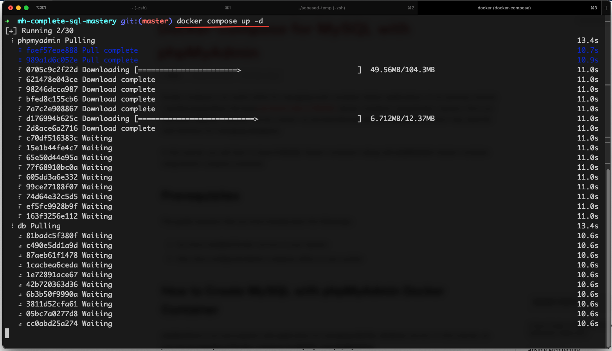
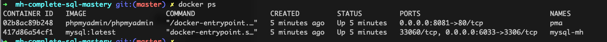
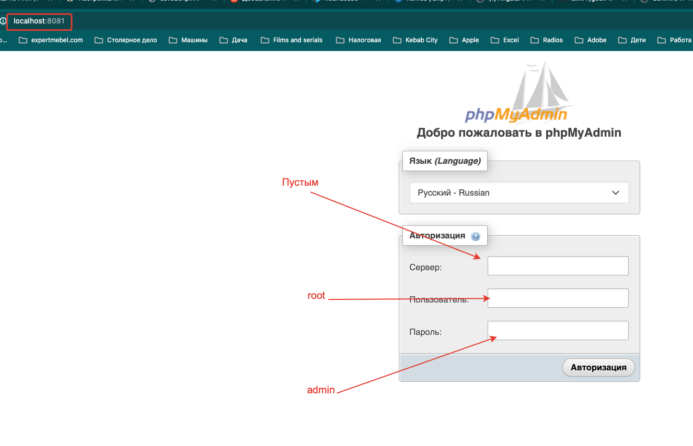
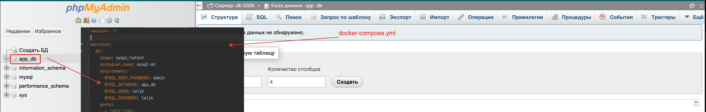
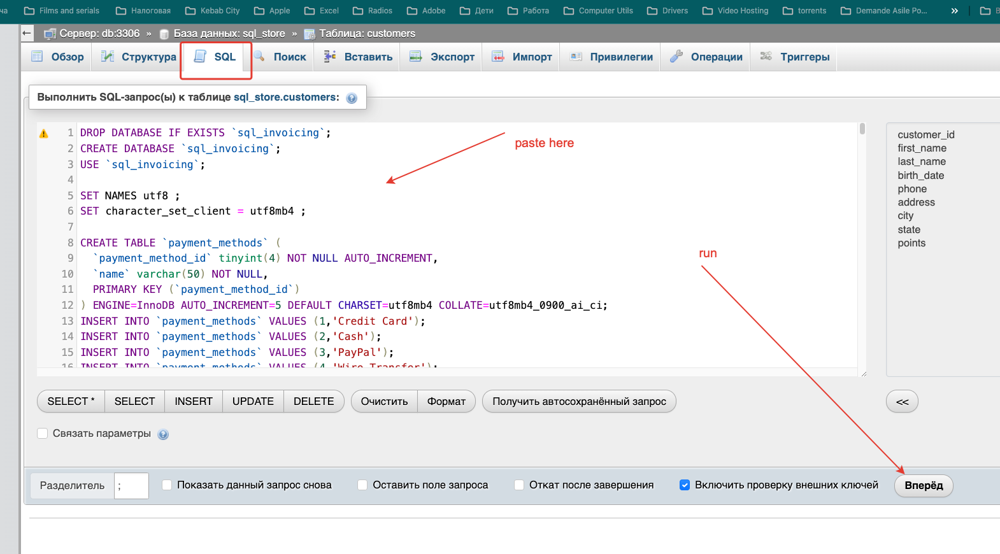
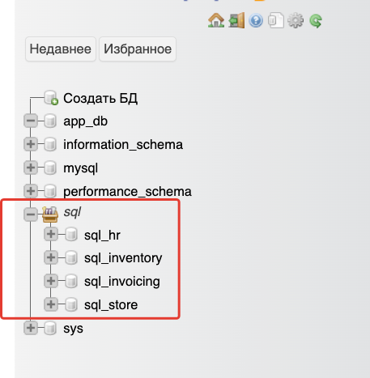
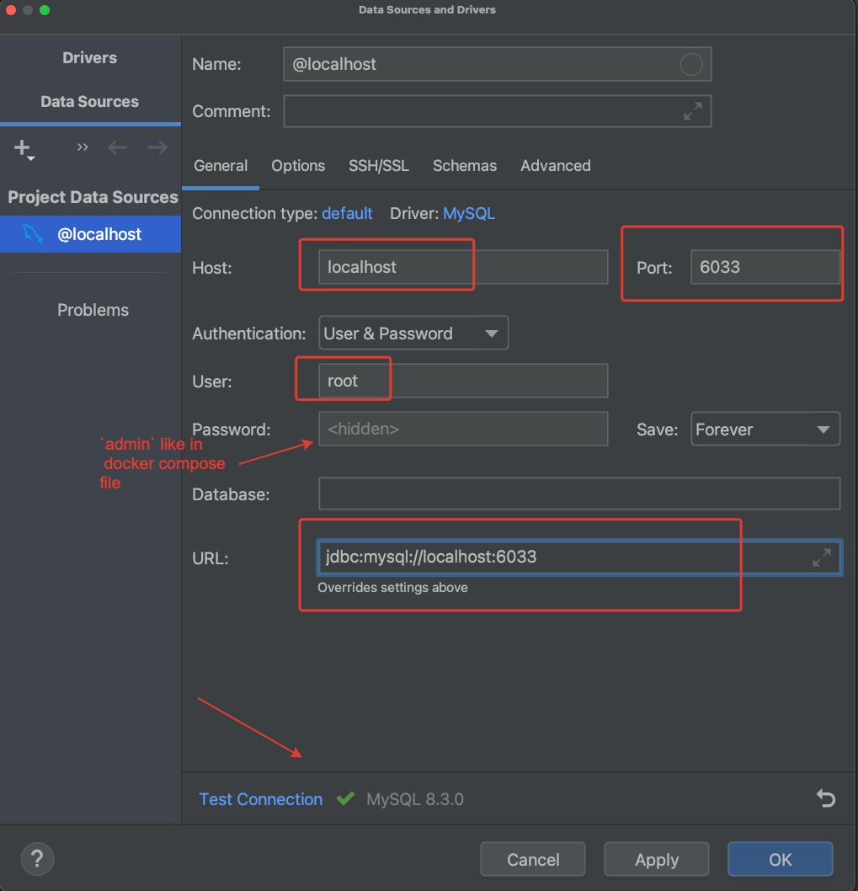

### Getting Started
Create `docker-compose.yml` file

```yaml
version: '3'

services:
  db:
    image: mysql:latest
    container_name: mysql-mh
    environment:
      MYSQL_ROOT_PASSWORD: admin
      MYSQL_DATABASE: app_db
      MYSQL_USER: lalik
      MYSQL_PASSWORD: lalik
    ports:
      - "6033:3306"
    volumes:
      - dbdata:/var/lib/mysql
  phpmyadmin:
    image: phpmyadmin/phpmyadmin
    container_name: pma
    links:
      - db
    environment:
      PMA_HOST: db
      PMA_PORT: 3306
      PMA_ARBITRARY: 1
    restart: always
    ports:
      - 8081:80
volumes:
  dbdata:
```

In terminal 



Verify if `mysql` and `phpmyadmin` are running



Launching `phpMyAdmin`





From `sql` folder , open with editor the `create-database.sql` file , copy and paste in phpMyAdmin 
in SQL TAB , and after run the script.



You will have this



I will use IDEA ultimate edition



Make the same query from file `create-databases.sql` and we will have 


In the future all queries  will be done in IDEA like in this example

