#  Retrieving data from a single table

### 1 - The `SELECT` STATEMENT

```sql
USE sql_store;

SELECT *
FROM customers
-- WHERE customer_id = 1 --
ORDER BY  first_name;
```

### 2 - The `SELECT` Clause

```sql
SELECT first_name, last_name, points, points + 10
FROM customers;

```


Using an ALIAS

1 - 
```sql
SELECT first_name,
       last_name,
       points,
       (points + 10) * 100 AS discount_factor
FROM customers;

```
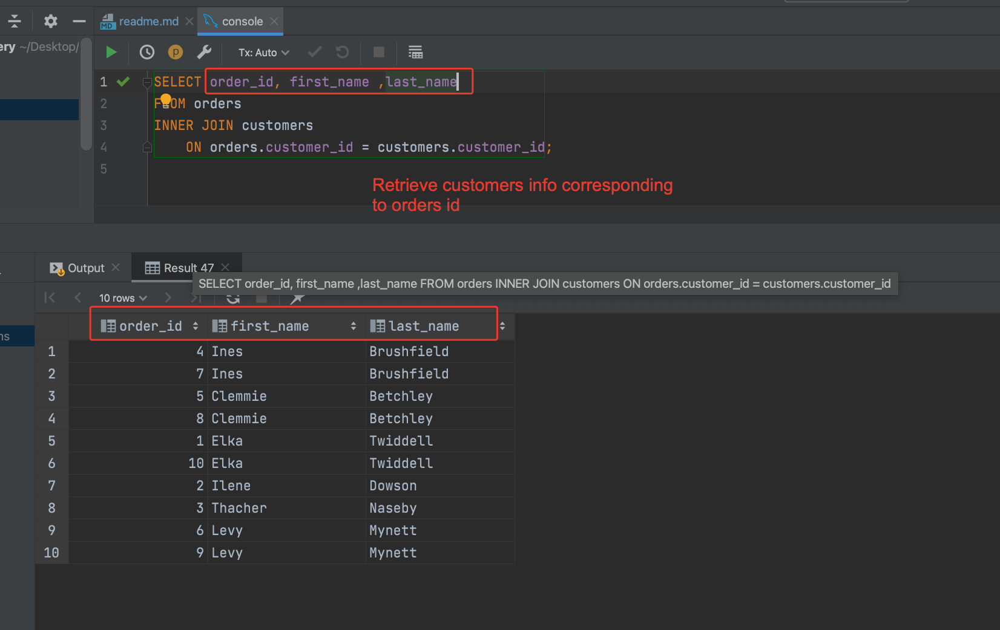

2- 
```sql
SELECT first_name,
       last_name,
       points,
       (points + 10) * 100 AS 'discount factor'
FROM customers;

```


Using DISTINCT<br>
We have two similar records
```sql
SELECT  state
FROM customers;
```
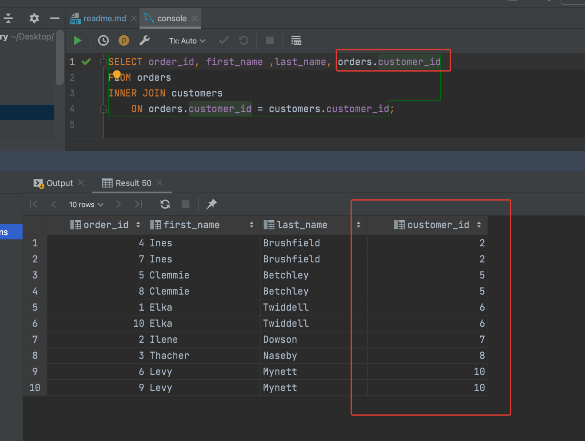
<br>With DISTINCT we retrieve the unique records
```sql
SELECT DISTINCT state
FROM customers;
```


#### Exercise

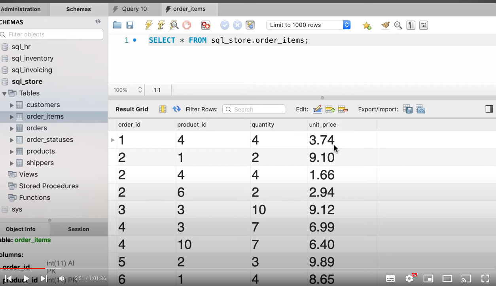

Solution


#### 3 - The `WHERE` Clause

Used to filter data.

```sql
SELECT *
FROM customers
WHERE points > 3000;

```


```sql
SELECT *
FROM customers
WHERE state='VA';
```


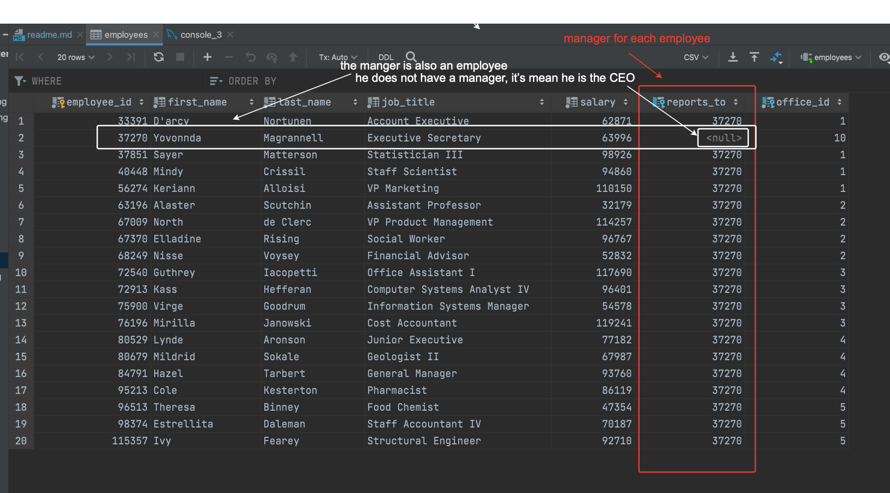

#### Exercise


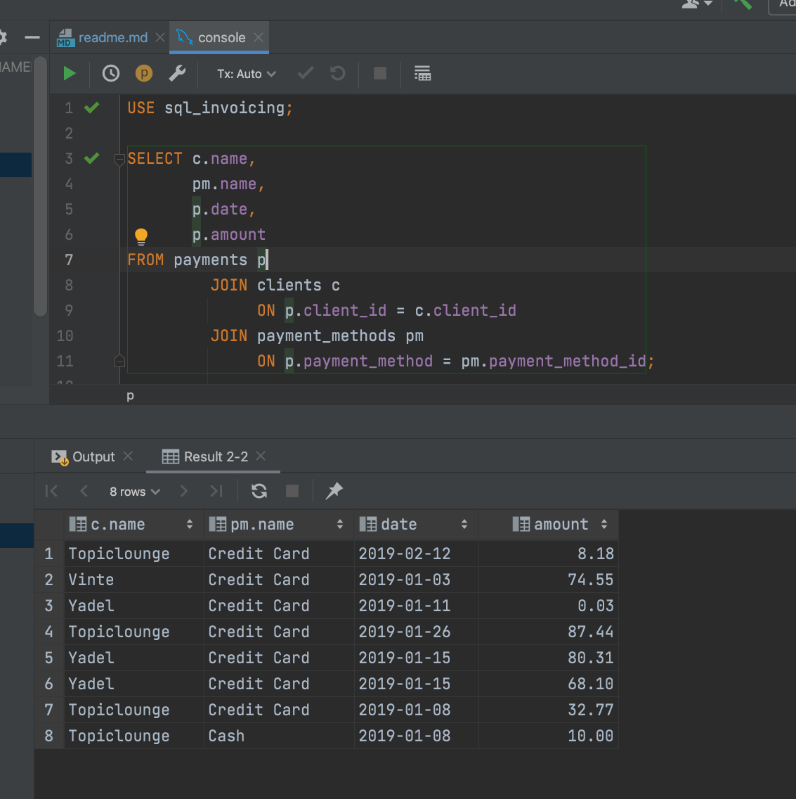

### 4 - The `AND` , `OR` and `NOT` Operators

Combine multiple search conditions when filtering data.

`AND`
```sql
SELECT *
FROM customers
WHERE birth_date > '1990-01-01' AND points > 1000;
```


`OR`
```sql
SELECT *
FROM customers
WHERE birth_date > '1990-01-01' OR points > 1000;
```


`Combine`

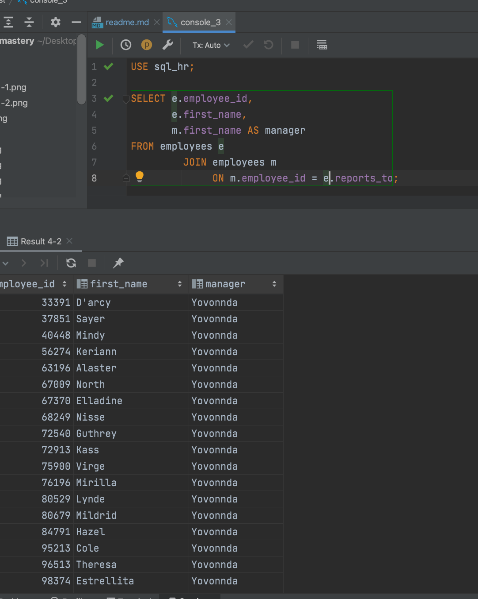

`NOT`


#### Exercise


### 5 - The `IN` Operator
There is a cleaner way and short way to get the same result.


We can use `NOT` to retrieve all records that not corresponding to that states


#### Exercise

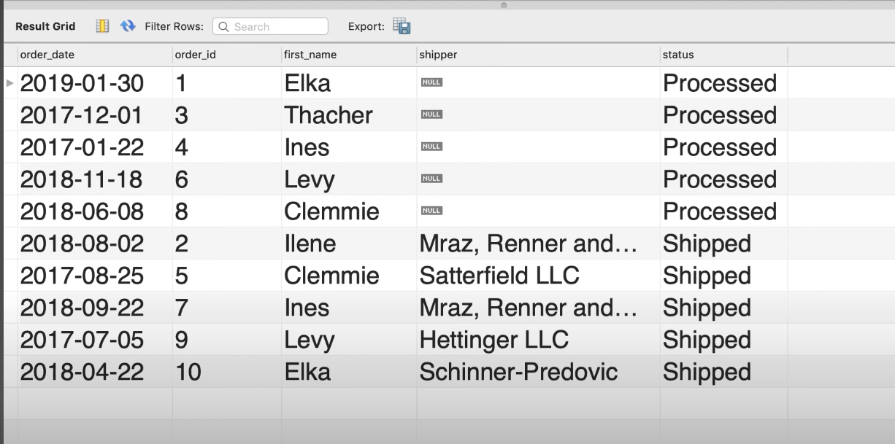


### 6 - The `Between` Operator

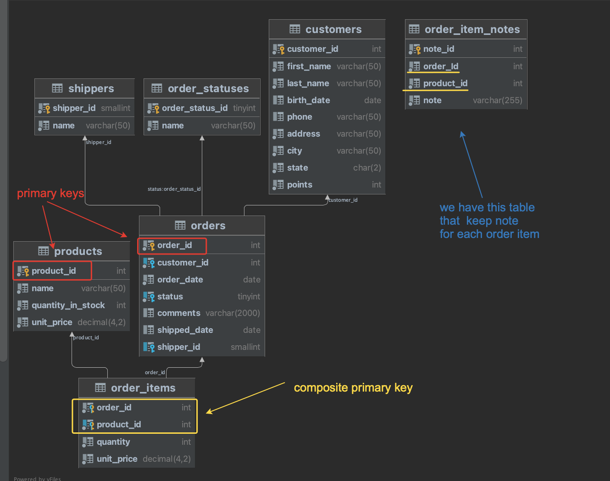

Equivalent code , pay attention that it's inclusive.
```sql
SELECT *
FROM customers
WHERE points BETWEEN 1000 AND 3000;
```
#### Exercise


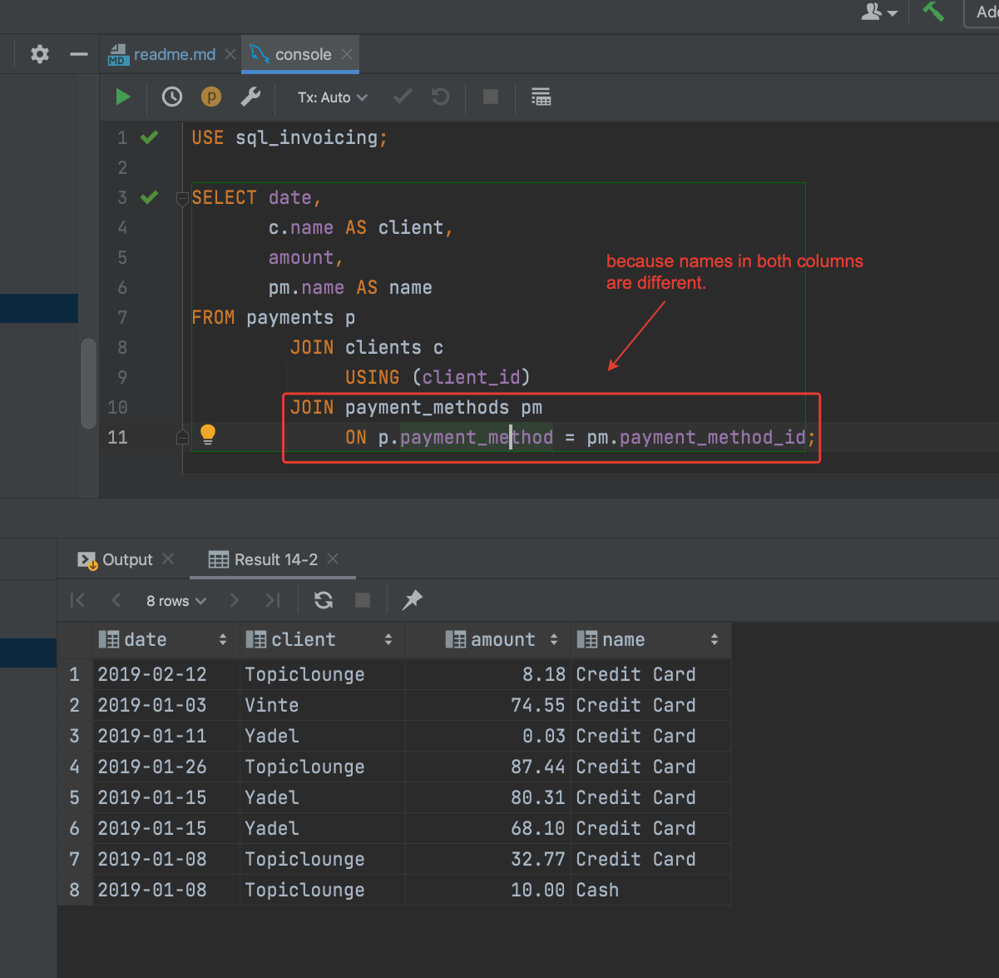

### 7 - The `Like` Operator

Using patterns with this operator
- % any number of characters

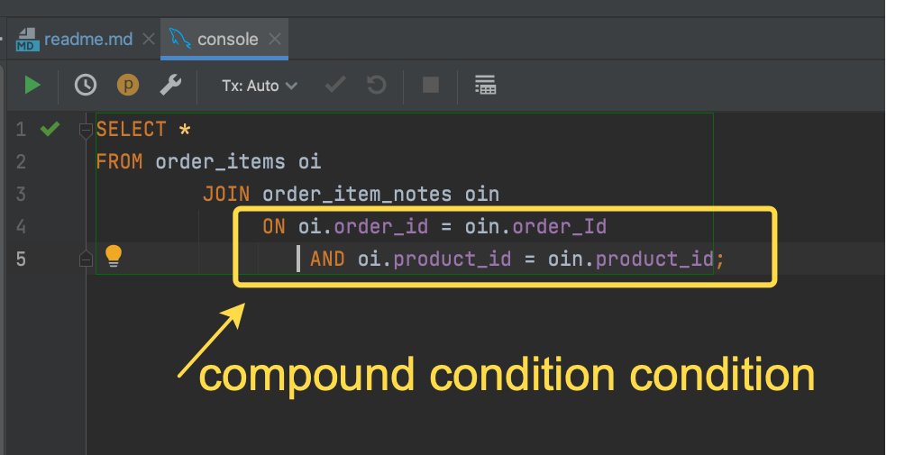

_ single character


#### Exercise
This exercice is about two parts

first part


second part


### 8 - The "REGEXP" Operator


`^` -> beginning of the string


`$` -> end of the string


'|' -> Or


'[ ]'-> 


#### Exercise
4 exercices


Solution 1

Solution 2

Solution 3

Solution 4


### 9 - The "Is NULL" Operator
Get records with missing values


Inverse cases


#### Exercise


### 1.9 The "ORDER BY" Clause

Sort data


In DESCENDING ORDER
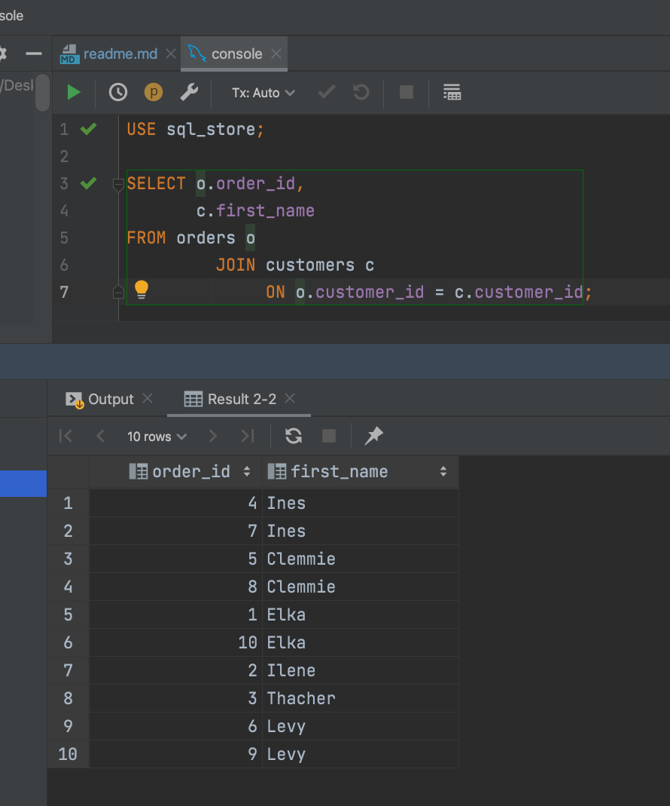

Sort data by multiple columns (MySQL -not all db managment systems have this)

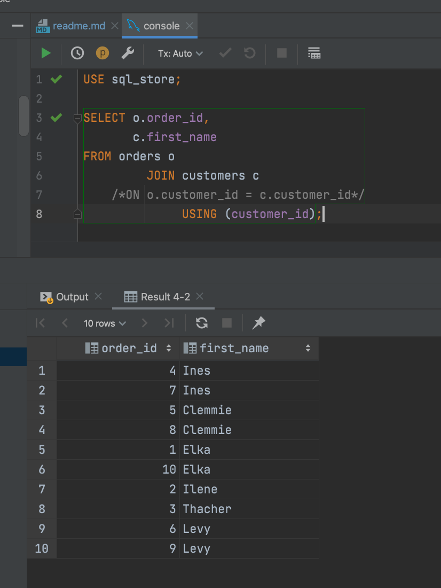
select 2 columns and sort by column that will not be shown (MySQL)

sort by alias and first_name
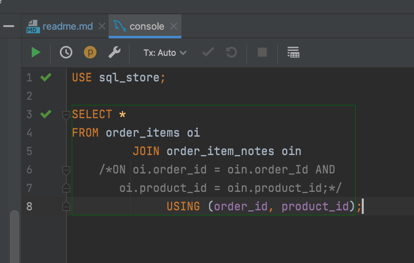
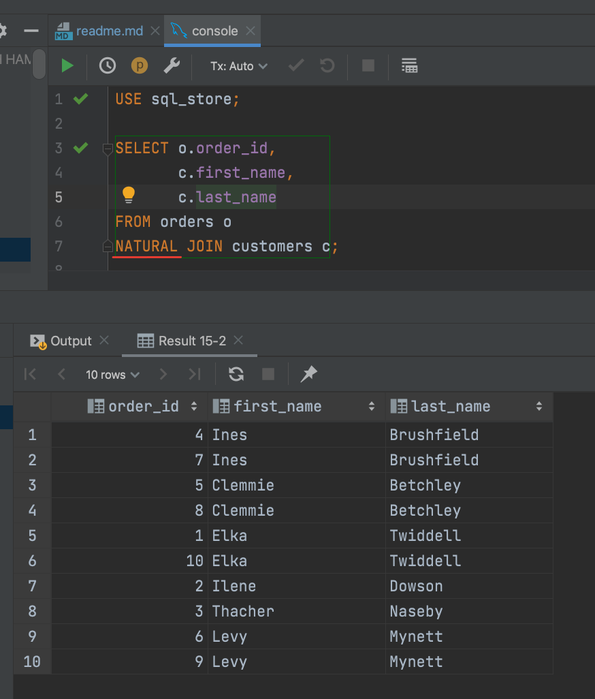

#### Exercise
In table order_items<br>
You have to write query , which will gives you this result.
Id = 2 , out 4 columns , and sort in Descending order by the total price<br>
(Total price = quantity * unit_price)


### 10 - The "LIMIT" Clause


#### Exercise


Algorithm -> order in Desc  , and limit 3


