# Retrieving data from a multiple tables

I will use Idea ultimate to generate visualisation for tables inside sql_store.

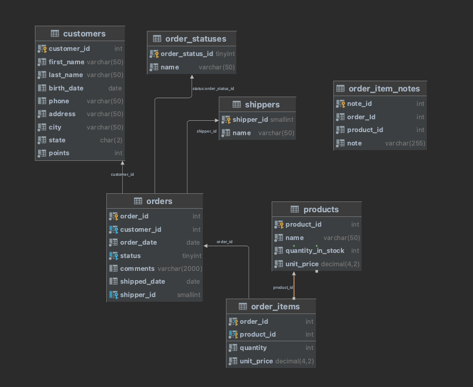

### 1 - The `INNER JOIN` STATEMENT

Inside `orders` table we don't store info about customers, we only store `customer_id`
We can do not write `INNER` , its by default.


We can say which columns we want to receive and retrieve data.


What if we add the field `customer_id`
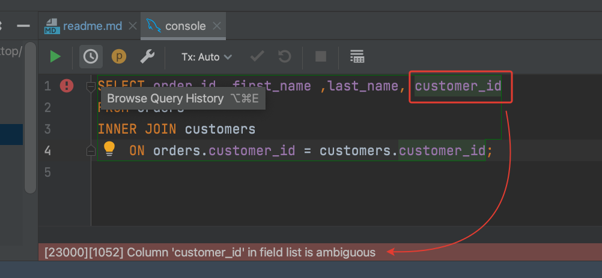

We have this column is present in two tables, we have to qualify


Pay attention when we are repeating words

For this we can use `alias`


#### Exercise 1


Look at the `order_items` table Write a query and join with products table. So for each order, return the product id,
and it's name, followed by the quantity and the unit price Use the `Alias` to simplify the code.


### 2 - Joining Accross Databases

How combine columns across multiple databases


### 3 - Self Joins

In SQL we can also join table with itself Example -> sql_hr


Let's take a look at the data inside

Self Join

Let's simplify the `select`


Joining a table with itself , it's pretty much like join different tables, the only difference we have to give different
alias and use those alis for columns.

### 4 - Joining Multiple Tables

How to join more than two tables when writing a query
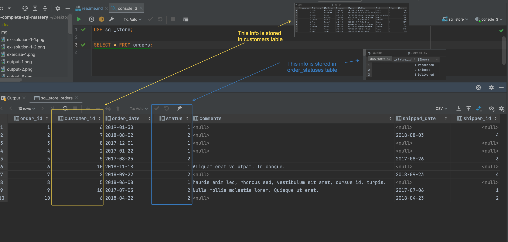
We want to write a query to obtain a report like this


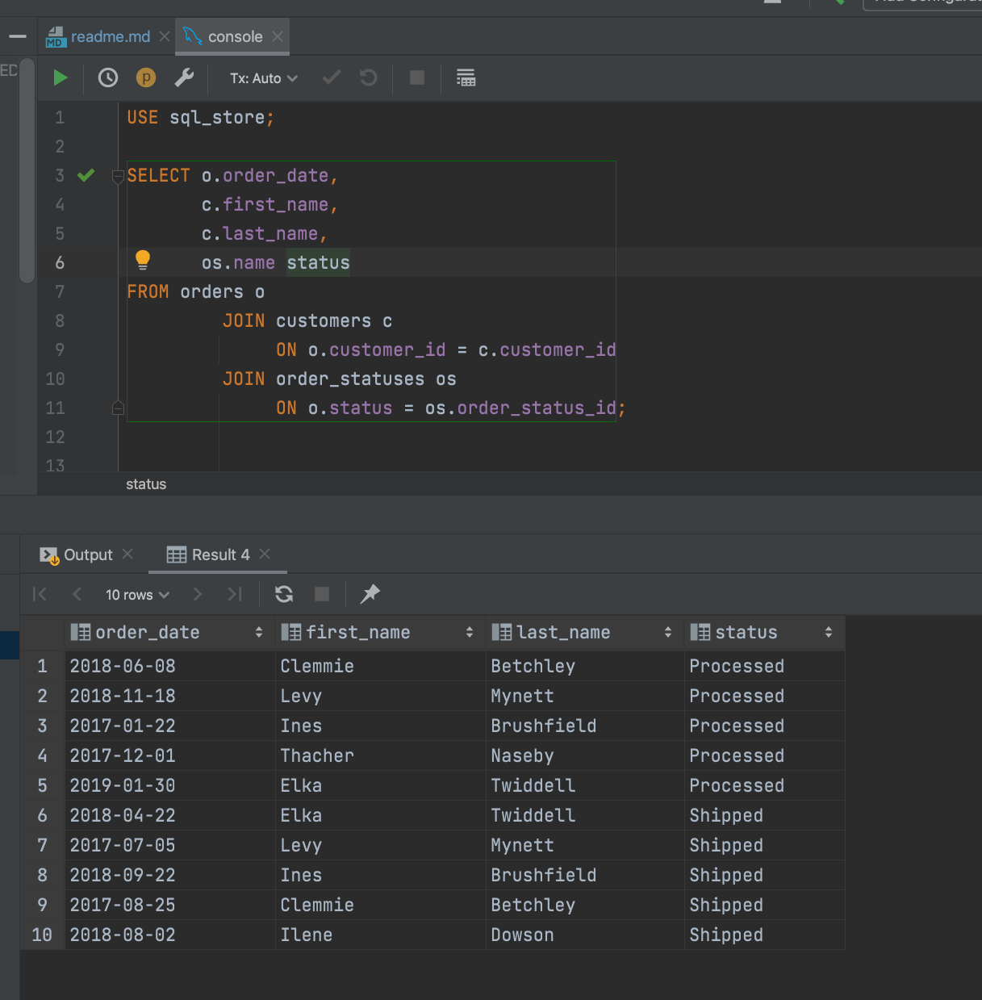

#### Exercise 2

In db `sql_invoicing`, we have this table store `client_id` and `payment_method` and other data. Join with `clients`
table and `payment_method`. Produce a view that shows the details of the cliend an the payment method.


### 5 - Compound Join Conditions

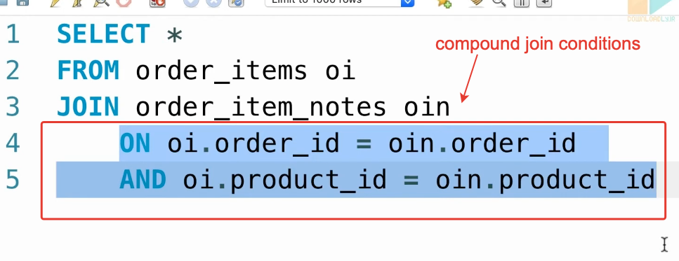

Look at this uml , we have `order_items` table that contains more than one primary key


in table `order_item_notes`we have two notes for `order_id=1` and `product_id=1`


### 6 - Implicit Join Syntax


### 7 - Outer Joins

`INNER JOIN` -> we can do not write `INNNER` <br>
`OUTER JOIN` -> `RIGHT JOIN` and `LEFT JOIN`


If we want to have all orders

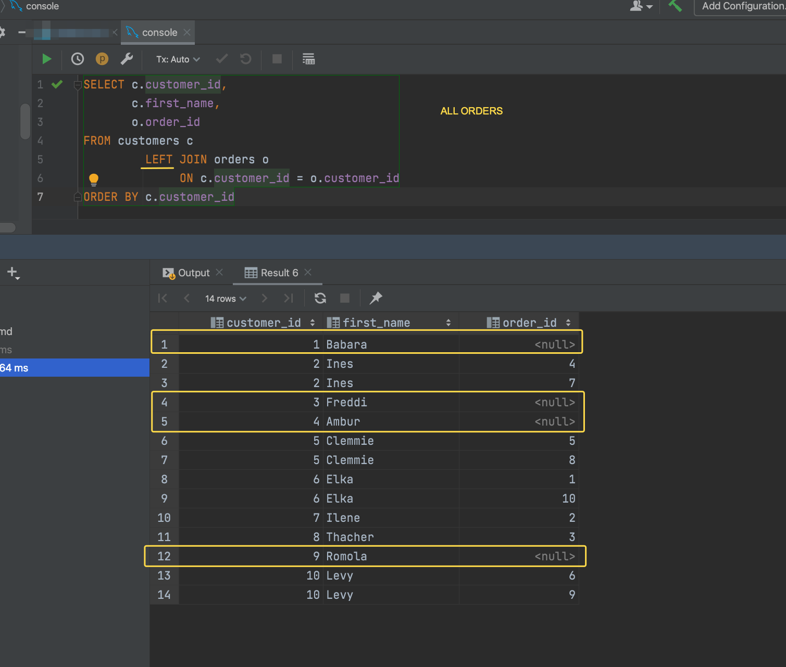

RIGHT JOIN will be SIMILAR to JOIN


#### Exercise 3

Write a query that produce this result. We need to join `products` table with `order_items` table.


### 8 - Outer Joins Between Multiple Tables


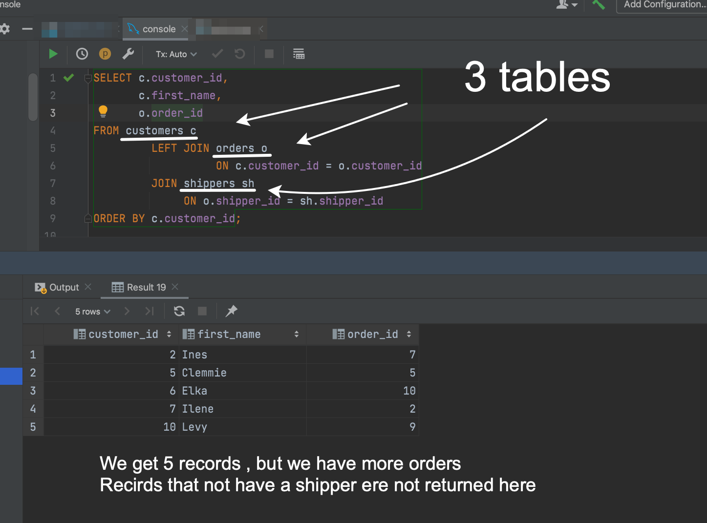

We will add `LEFT`


As a best practice avoid to use `RIGHT JOIN` and use `LEFT JOIN` instead.

#### Exercise 4

Write a query that produce this result.


### 9 - Self Outer Joins

In `sql_hr` db we have `employees` table.<br>
With `LEFT` join we produce all record, even the condition is true or not

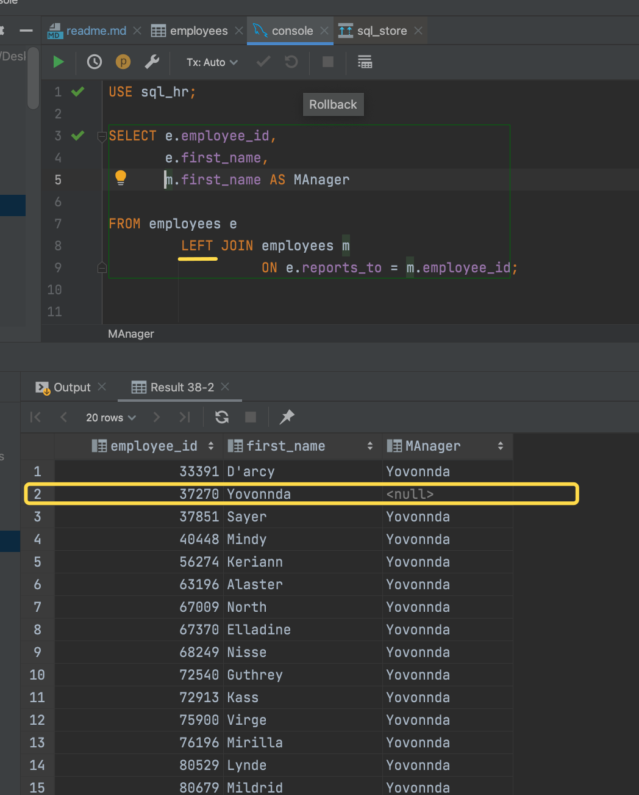

### 10 - Using Clause

Let's take a look to this query


```sql
ON o.customer_id = c.customer_id;
```

Can be replaced by this and like this is more readable

```sql
USING
    (customer_id)
```


Let's take a look to another query

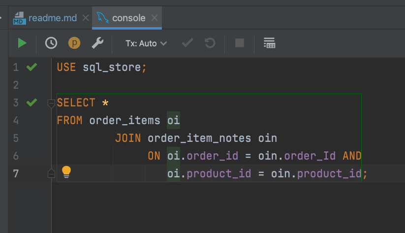

#### Exercise 5

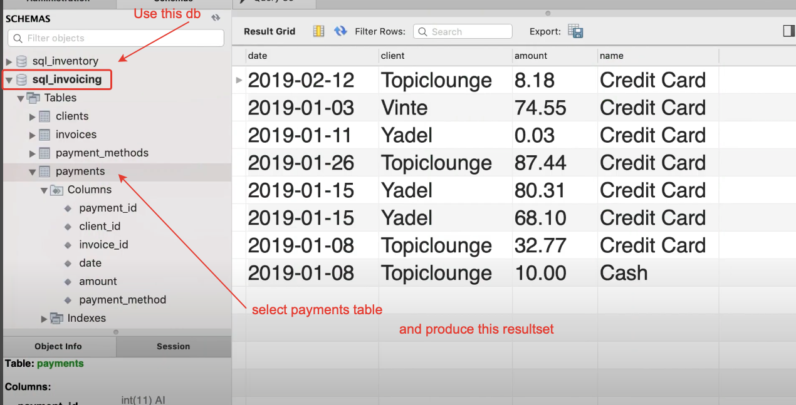

Let's generate in Idea uml diagram


### 11 - Natural Joins

Let's generate uml diagram for sql_store


Easy to code but can be dangerous. Can produce unexpected results.


### 12 - Cross Joins

Explicit Syntax
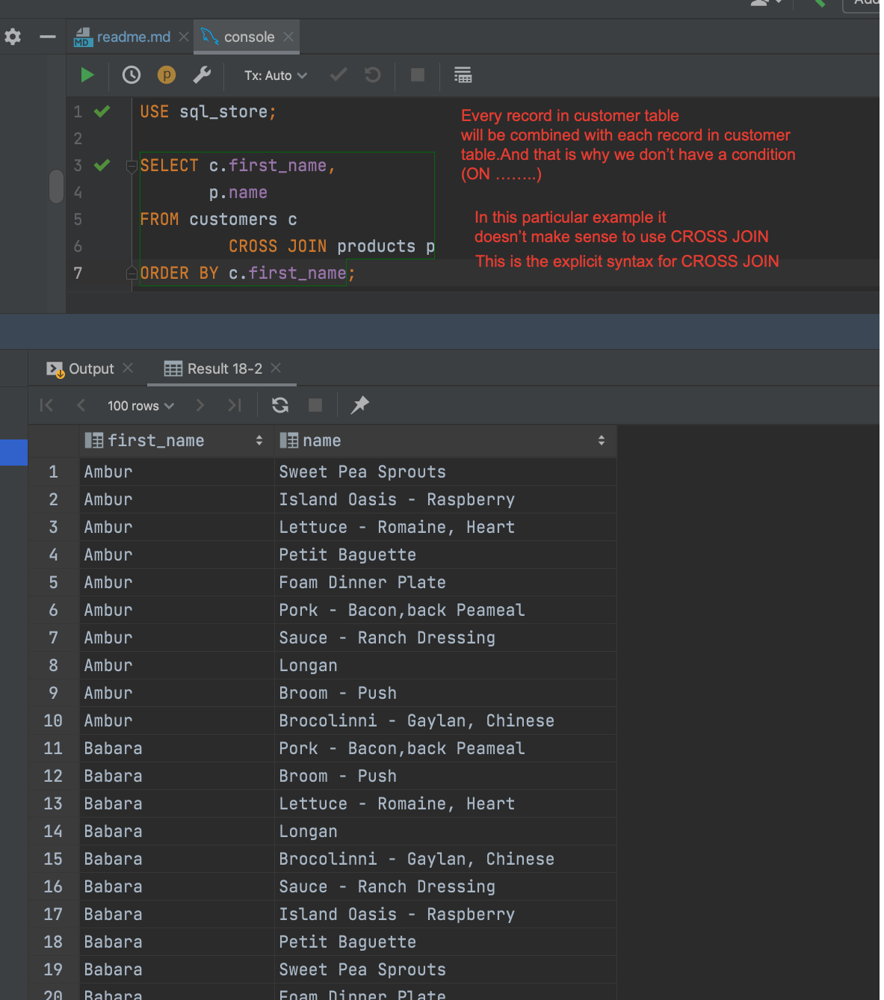

Implicit Syntax


#### Exercise 6

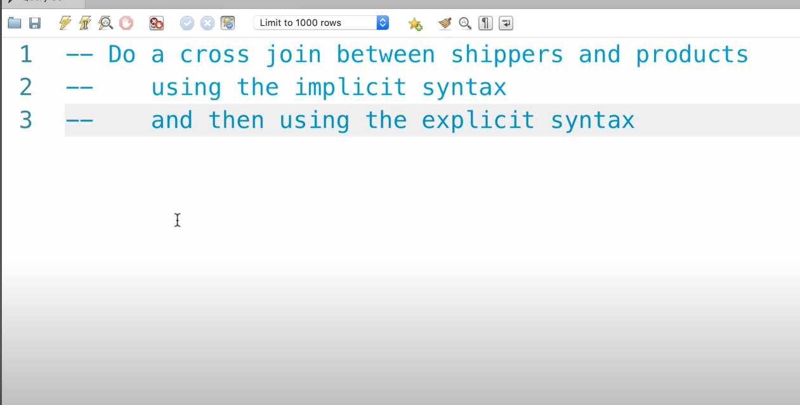

Explicit syntax


Implicit syntax


### 13 - Unions

Using `UNION` we can combine records from multiple queries.

13.1 - Against the same table

Let's take a look to this query

```sql
USE sql_store;
SELECT order_id,
       order_date,
       'Active' AS status
FROM orders
WHERE order_date >= '2019-01-01';
```


And to another query

```sql
USE sql_store;

SELECT order_id,
       order_date,
       'Archived' AS status
FROM orders
WHERE order_date < '2019-01-01';
```


We can use 'UNION'
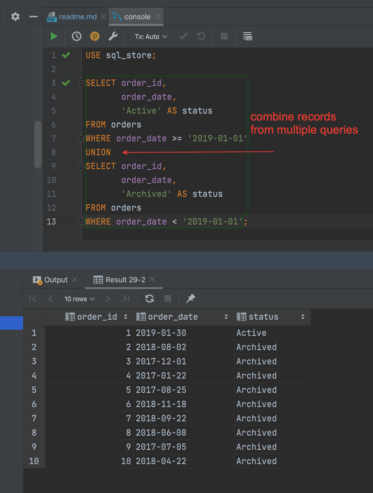

Both those queries are against the same table

13.2 - Against different tables and combine result into one resultset


If we inverse the order of queries


<span style="color:red">13.3 - Important remark </span>


#### Exercise 7
Write a query to produce this report

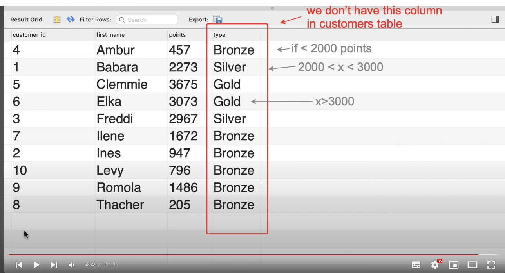

```sql
USE sql_store;

SELECT customer_id,
       first_name,
       points,
      'Bronze' AS type
FROM customers
WHERE points < 2000

UNION

SELECT customer_id,
       first_name,
       points,
       'Silver' AS type
FROM customers
WHERE points BETWEEN 2000 AND 3000

UNION

SELECT customer_id,
       first_name,
       points,
       'Gold' AS type
FROM customers
WHERE points > 3000

ORDER BY first_name;

```


